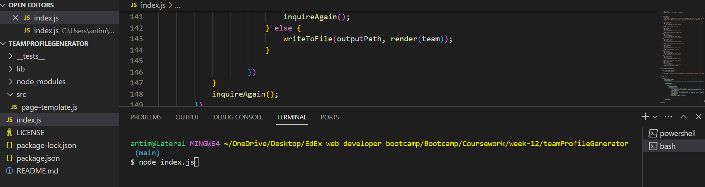
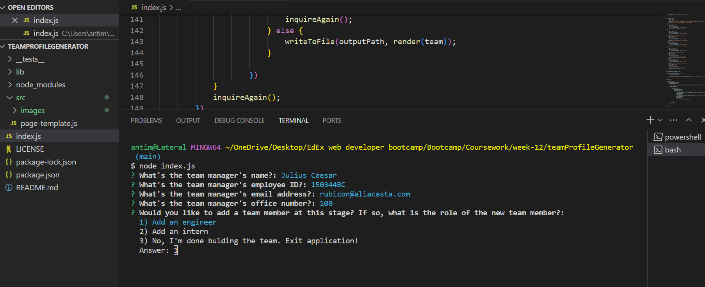
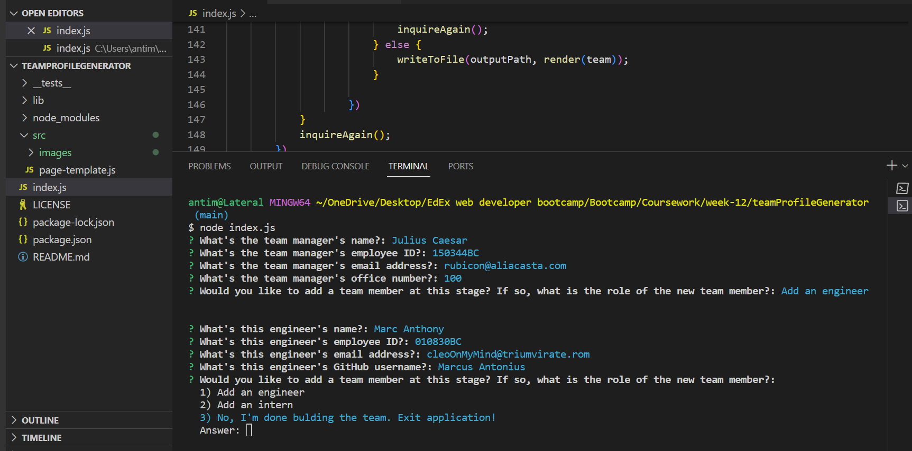
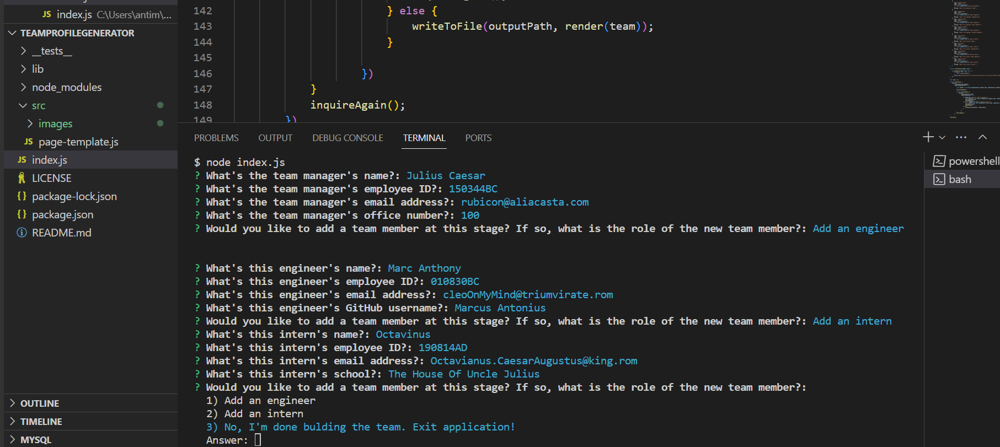
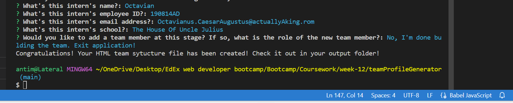
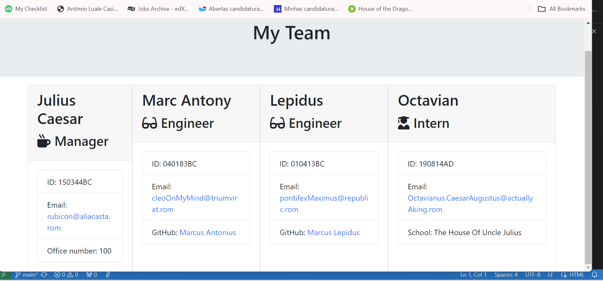

# Team Profile Page Generator
  
## A program that allows the user to enter details regarding the members of a software development team.

This project was carried out to create an app that allows the user to create a profile page for a professional team where employees can be either a manager, an engineer or an intern. The user is prompted to create these instances of employees. When the user is done creating these instances, an html page containing the basic profiles (data entered by the user), in the form of cards, is created.
  
## Table of Contents
  
- 
- 
- 
- 
- 
- 
  
## Installation
  
This app can be installed by downloading (copying the code files) from the developer's git repositoty onto the user's pc. The files should be copied in the same arrangement as they are found in the git repository. The user should have access to node (preferably).
  
## Usage

This application can be used by installing node onto the user's pc and calling the main javascript file in the node command line i.e. "node index.js".

To use the program:

1 - Using the command line, navigate to the location of the index.js page. Run the command "node index.js".

2 -When the prompt for the Manager's details pops up, enter those details.

3 -When the prompt for the Engineer's or Intern's details pops up, enter those details.

4 - Once all the inputs have been entered and the user selects the option to stop running the program as a sign that they are finished, a message will appear confirming that the HTML page has been created and rendered.

5 - Navigate to the output folder and open the HTML page in your favourite browser.

  
## License
  
MIT License

Copyright (c) [2024] [Antimio Luale Da Silva Monteiro Casimiro]

Permission is hereby granted, free of charge, to any person obtaining a copy
of this software and associated documentation files (the "Software"), to deal
in the Software without restriction, including without limitation the rights
to use, copy, modify, merge, publish, distribute, sublicense, and/or sell
copies of the Software, and to permit persons to whom the Software is
furnished to do so, subject to the following conditions:

The above copyright notice and this permission notice shall be included in all
copies or substantial portions of the Software.

THE SOFTWARE IS PROVIDED "AS IS", WITHOUT WARRANTY OF ANY KIND, EXPRESS OR
IMPLIED, INCLUDING BUT NOT LIMITED TO THE WARRANTIES OF MERCHANTABILITY,
FITNESS FOR A PARTICULAR PURPOSE AND NONINFRINGEMENT. IN NO EVENT SHALL THE
AUTHORS OR COPYRIGHT HOLDERS BE LIABLE FOR ANY CLAIM, DAMAGES OR OTHER
LIABILITY, WHETHER IN AN ACTION OF CONTRACT, TORT OR OTHERWISE, ARISING FROM,
OUT OF OR IN CONNECTION WITH THE SOFTWARE OR THE USE OR OTHER DEALINGS IN THE
SOFTWARE.
  
## Contributing
  
Other developers can go onto the developer's git repository (which is public), clone the repo, and integrate the app onto another app or build the app itself into more complex file generators.
  
## Tests
  
This app can be tested by entering widely variable numbers of employee instances when being prompted by the app. 
  
## Questions
  
For any questions, please contact me at antimiocasimiro@gmail.com or visit my GitHub profile https://github.com/Antimio.